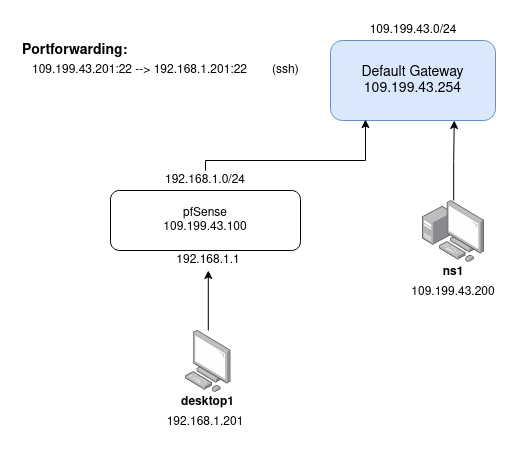

# CYBE230 Lab 4 - Network Firewalls

This lab we created a new pfsense firewall to do virtual ip forwarding of our public ip addresses, and port-forwarding for the services that we will set up. In this lab we set up port-forwarding for ssh from the virtual machine doing automated checks to our desktop machine through the firewall.

The network diagram after the initial firewall setup is shown below.

