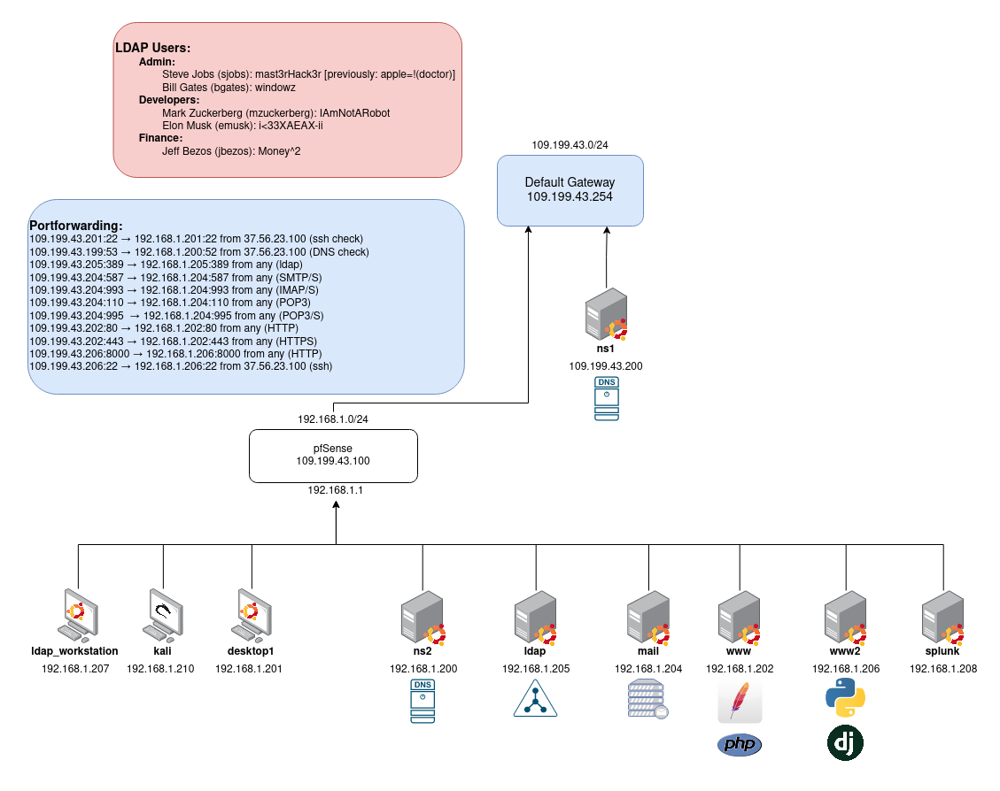

# CYBE 230 - Introduction to Cyber Security Fundamentals

Final Network Diagram of the CYBE230 Network\
\
The first in the series of required Cyber Security Classes at Iowa State University. This class is an overall introduction into what it is like to be a Blue Team member. It has a student doing mostly lab based work of creating systems, and building out a network. In a couple of the labs we talked about common web vulnerabilities, showed examples of them, and how to mitigate them. This class is also cross listed as CPRE 230, so at any point if you say that it is the same class

[Labs](Labs/index.md) - Individual Labs and what we did in each of the labs.
