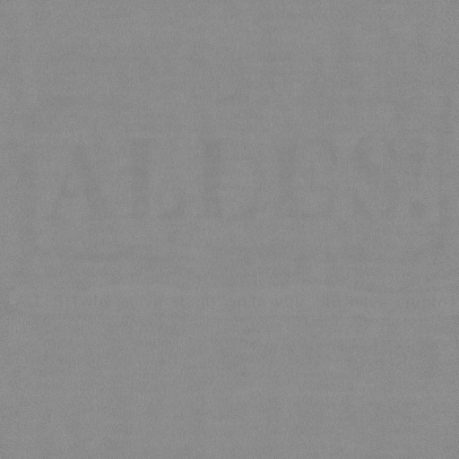
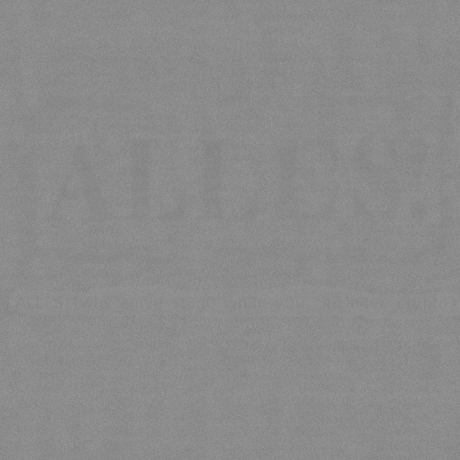
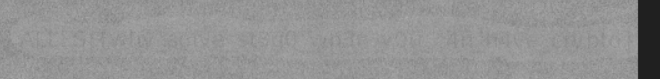

# NoStego

For the Nostego challenge we were given an image file that at first glance looks like a random mess of greys, a script used to manipulate the original image into what we were given, and a note saying ```It cannot be stego because the source is attached.```


```py
from PIL import Image
import sys

if len(sys.argv) != 3:
    print("Usage: %s [infile] [outfile]" % sys.argv[0])
    sys.exit(1)

image = Image.open(sys.argv[1]).convert("F")
width, height = image.size
result = Image.new("F", (width, height))

ROUNDS = 32

for i in range(width):
    for j in range(height):
        value = 0
        di, dj = 1337, 42
        for k in range(ROUNDS):
            di, dj = (di * di + dj) % width, (dj * dj + di) % height
            value += image.getpixel(((i + di) % width, (j + dj + (i + di)//width) % height))
        result.putpixel((i, j), value / ROUNDS)

result = result.convert("RGB")
result.save(sys.argv[2])
```

My first thought when I saw the script, was that where very little fancy cryptography and it was closer to a set of equations used to move around and change the value of pixels. 
The first  and the second  with  and  all with height and width replaced with 512 since we know the size of the picture is fixed at 512x512.

The next thing I thought was that just inverting these two equations would get the exact opposite of what the script was doing and be able to reverse the image we were given to the original image. I decided to tackle it from the top to the bottom starting with  and . However, when taking a look at how to do the inverse of modulus I was stumped and couldn't figure it out, but realized that since the value of  and  do not rely on the x or y position of the pixel being manipulated I could probably just run them in reverse as a start. 

So the next step was to make a script that saved the 32 values for each variable, then reversed and printed the array
```py
ROUNDS = 32
di = 1337
dj = 42
di_values = []
dj_values = []

for k in range(ROUNDS):
    di, dj = (di * di + dj) % 512, (dj * dj + di) % 512
    di_values.append(di)
    dj_values.append(dj)

di_values.reverse()
dj_values.reverse()
print(di_values)
print(dj_values)
```

Using the arrays this put out I was able to simplify the script to just a single important line ```value += image.getpixel(((i + di_values[k]) % width, (j + dj_values[k] + (i + di_values[k]) // width) % height))```

While just replacing it did not lead to much happening, I decided to flip some of the addition signs and replace them with subtraction signs, which ended up giving me a rather blurry, but identifiable image with the ALLES! logo visible, and a line of text slightly visible below it.



While this image was pretty blurry, I decided to try and flip the integer division with multiplication to make the image clearer without having to deal with the mess that is doing the inverse of modulus. After doing that, the image came out clearer with a better contrast that was more readable, and how I got most the flag.



There were still some missing letters though that I was unable to get right away, so I put in a simple image editing software to play around with the contrast whihc helped me get the final few letters I was missing. 



After doing this I was able to find the flag to be ```ALLES!{why_solve_st3g0_wh3n_y0u_c4n_h4ve_crypto}```
