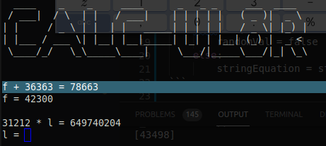

# Calculator

On the challenge you were given the command ```nc 35.211.207.36 8000``` and when running the command you are greeted with ```CALC-UL8R``` in ASCII art, and an equation with a line after with the variable and an equals sign. After putting in the right value it prints a new equation, and if you give the wrong solution it gives ```ERROR: DOMAIN```.

Correct Answer:

Incorrect Answer:


So my first thought was that you need to solve a bunch of equations, and it will give you the flag as a scripting challenge. So the first thing I did was start trying to figure out a way to parse the equation and solve for the variable that was being asked for. After some googling I found sympy that appearred to do everything I wanted by taking an equation as a string and solving it. Though I did run into some issues where the parser did not like the equal sign, so I split up the line using this code in while loop.

```py
tempChar = f.read(1)
    if tempChar == '=':
        randomVal = false
    elif tempChar == '\n':
        randomVal = false
    else: 
        stringEquation = stringEquation + tempChar
```

This did require me to create two individual expression then set them equal to each other before being about to actually get the solution and print it.

```py
eq1 = parse_expr(stringEquation)
eq2 = parse_expr(stringEquation2)
equation = Eq(eq1, eq2)

sol = solve(equation)
print(sol)
```

Since I had it reading from a text file, I thought let's just try piping the netcat output into a file then having the script parse, and send back the appropriate responses. That however, was a colossal failure, and something I could not get working. My next thought was to use a socket, which seemed rather daunting since I had never used it before, but after realizing that is the best option by far. I decided to jump in head first and figure it out.


Knew nothing very liitle sockets beforehand so it was all real new
Grabbed the data from the socket and got it into a string
Parsed the string into things that symnpy liked
used sympy to solve
converted to bytes to send to the socket
got the new data from the socket and parsed it into sympy compatible strings
set to repeat 500 times
Let it run til it crashed as the flag most likely would not be able to be parsed into an equation


SNYK{37d779963c037715c02624b6963008f55e92d12e8714a15b7a905c1c997d1afc}

