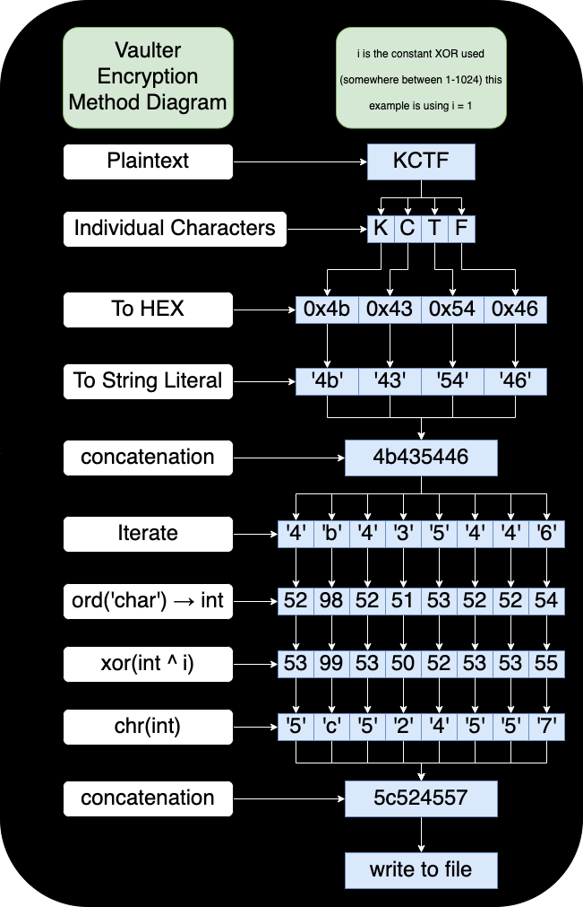
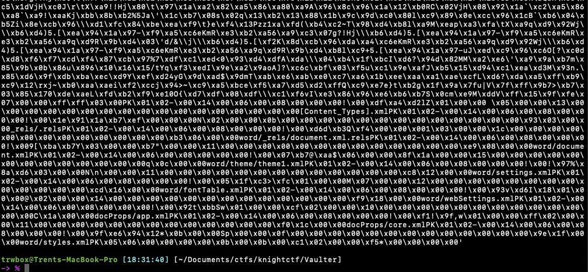
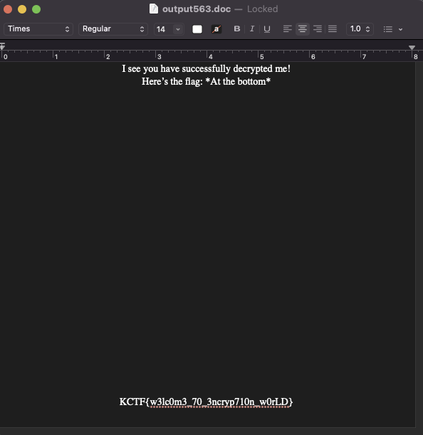

# Vaulter

## Description

A freshermen of XOR University of Science & Techonology has acquired keen interest in cryptography. To protect his files, he has created a script that encrypts the files. Are you capable enough to get the file(s)?

Demo Flag: KCTF{some_text_here}

Author: fazledyn

## Other information

Value: 100 points

Files:

- [vaulter-challenge.py](./vaulter-challenge.py)
- [vaulter-output.enc](./vaulter-output.enc)

## Solution

This was a rather interesting challenge that uss an interesting custom encryption scheme. It took me the better part of an hour digging through the encryption method, and invloved a lot of commenting code, and adding temporary holding variables, as I ran and single stepped the code with a known plaintext. This commentted code can be seen in the [vaulter-challenge-comment.py](./vaulter-challenge-comment.py) file. However, I decided to make a diagram of the process to make it easier to understand.



After figuring out the encryption scheme, I wrote a script to do the decryption for me [vaulter-dec.py](vaulter-dec.py). This took that diagram and flipped it backwards. The firs thing I did in the script was read in the encrypted file, and turn in back into an int so we were at the `xor(int ^ i)` of the diagram. Now I just had to find the correct i, with 1024 values, and multiple kilobytes of data I had to devise a better method that just trying them all and writing to a file. So what I did was use the following pseudocode where I check that after the XOR if the character is a hex character, if it isn't I break out the loop, clear the output, and try the next int.

```pseudo
for i in range(1024):
    value = int ^ i
    if chr(value) in hex_chars:
        out += value
    else:
        break

```

The next step was if the whole file after the xor was valid hex characters, then from the long hex string, to the actual raw data that hex represents, then putting that back into a file and checking for the flag. Since I was unsure how many outputs I would have, I also have the file output include the value of i that was used to decrypt it. After running the script however, there was only a single output, that did not seem like the flag as it wasn't raw text. I had the script print the raw bytes it was getting, and it looked this:



At first it looked like a bunch of complete garbadge, but then near the bottom I noticed some things like `docProps/core.xml` and `docProps/app.xml` it dawned on me that this looked like something that comes out when you runs strings on a Microsoft office file. So I decided to run a quick file command on the output, and it revealed that it was a Microsoft Word Document. Opening the document and it revealed a short message, then the flag at the bottom of the page.



This what the flag ended up being `KCTF{w3lc0m3_70_3ncryp710n_w0rLD}`
