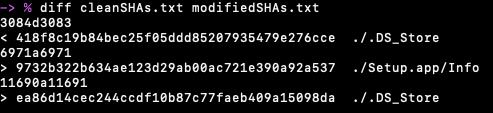

# H3LLO IOS

## Description

Siam is trying to Bypass his iPhone 6s by IOS firmware modification. He decrypt the file but he failed to modify it. but in the Application section, he has dropped a message.

Demo Flag: KCTF{D3m0_fl4g}

Author: AxifAhmed

## Other information

Value: 100 points

Files:

_THESE ARE NOT MY LINKS AND MAY GO DOWN AT ANY TIME._

They merely contain an ios 9.1 firmware image with a modified file. This is too large to upload to github, so it will remain with their hosting.

- [Link](https://drive.google.com/drive/folders/1_4JBD0wH2yznb4FnlI5TaZUQRmGVnUnN?usp=share_link)
- [Alternate Link 1](https://drive.google.com/file/d/1F8P1hslXCeaJ_7wQ4Mcu1240bOJRW1V6/view?usp=sharing)
- [Alternate Link 2](https://drive.google.com/file/d/1-YIFHvtNVLdzB09TbtzivFOqoib7sUGU/view?usp=sharing)

## Solution

With this challenge we were given an iPhone 6s iOS 9.1 firmware image in a .ipsw file format, but had been told that the something had been modified in the Applications/ folder of the udpate. From experience with iOS jailbreaking, I knew that IPSW files, are nothing more than a zip file with the contents of the update. So the first thing I did was unzip the file to get the whole contents package. That will give us some xml files with information about how to update, and bunch of .dmg files which are Apple disk image files. From previous knowledge the largest of these is the root filesystem of the update that would contain the Applications folder. Traditonally iOS dmgs in the iOS 9 era were encrypted, and needed to be decrypted, but I thought I might as well try mount the modified dmg because what would it hurt, and to my surprise, it mounted just fine, and I could explore the contents. I jumped straight into the Applications folder which contained all the apps that would be in the update.

You might think how can you get something out of a .app file, it's probably compiled like most executables. Well, they are not at all, all a .app is a folder with a special name that Apple OSes recognize as an app, so you can enter any of them just as you would any other folder on the system. My original hope was to to jsut manually look through and find a difference, but with 85 apps, and all their subfolders that deemed impossible, so I had to find a different way. I first tried to just use grep and search for the flag format, but that returned nothing. So my next idea was to hash every file, and find which ones were modified between the original and this copy. I went out and found the official ipsw on [ipsw.me](https://ipsw.me), where they had a link to the still available official downlaod [here](http://appldnld.apple.com/ios9.1/031-37782-20151020-4bfff3dc-701e-11e5-b642-338352d92a8c/iphone8,1_9.1_13b139_restore.ipsw).

Finding the image was just the first part of the challenge for me though. I could open the image and get out the dmg, but when I tried to mount it, I was greated with the fun enter password prompt meaning it needed to be decrypted. Thankfully, thanks to jailbreakers, all the keys to decrypt the iOS updates are available and this specific set can be found on [The iPhone Wiki](https://www.theiphonewiki.com/wiki/Boulder_13B139_(iPhone8,1)) which gets that figured out. But that isn't where my issues stopped, I spent a long time trying to find a tool that could decrypt these images on an M1 mac, but with some of the most recetn tools ebign updated the better part of 5 years ago, I could not find a single tool that would get the dmg decrypted...

This is where I enlisted the help of some of my friends in the room with Windows computers. I was able to find a relatively modern tool that had been updated in the past year [iDeccryptIt](https://www.theiphonewiki.com/wiki/IDecryptIt), but it only had Windows versions available. So using the joys of a python's http server, I sent over the dmg I needed decrypted to a friend, and they were able to decrypt it for me, open their own http server, and send it back to me, where I could mount it like the prior dms and go exploring. 

Since we knew the flag was in the Applications folder I ran this quick one line script `find . -type f \( -exec sha1sum {} \; \) | sort > ~/Desktop/iPhone/fileName.txt` in each Application folder to hash every file, then write the outputs to the files [cleanSHAs.txt](./cleanSHAs.txt) and [modifiedSHAs.txt](./modifiedSHAs.txt) for the clean and modified respectively. This then let me run a diff on the two files, and find which files had been changed.

There were a couple of macOS metadata files that were different, and a single file in Setpup.app callend Info. And to my surprise there was a pastebin link in the file... So I couldn't have foudn it with the flag format, which was a little disappointing, but I survived.

I went to the pastebin link, and found the flag. However, it has since been removed, and I did not save the flag meaning it is lost to history for me, but at one time there was a flag at that link.
