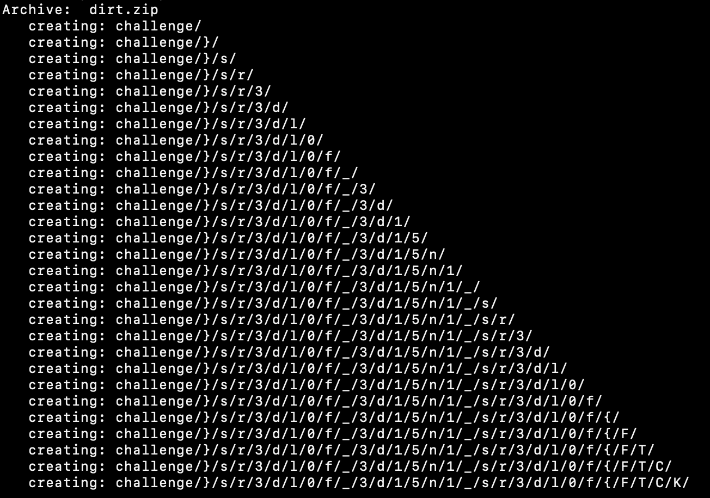

# Dirt

## Description

My friend loves to travel. Can you help him get the flag?

Demo Flag: KCTF{t3xt_h3r3}

Author: fazledyn

## Other information

Value: 50 points

Files: [dirt.zip](./dirt.zip)

## Solution

For me this was a super fast challenge, that took almost no time, and I fully atribut that to the MacOS unzip tool. While unzipping, it gives the folder structure as it unzips.

This showed me that the folder structure created looked like a backwards flag `creating: challenge/}/s/r/3/d/l/0/f/_/3/d/1/5/n/1/_/s/r/3/d/l/0/f/{/F/T/C/K/`. I took this and put it into cyberchef, reversed it, and removed the folder structure to get the flag. [CyberChef Recipe](https://gchq.github.io/CyberChef/#recipe=Reverse('Character')Find_/_Replace(%7B'option':'Regex','string':'/'%7D,'',true,false,true,false)&input=ICAgY3JlYXRpbmc6IGNoYWxsZW5nZS99L3Mvci8zL2QvbC8wL2YvXy8zL2QvMS81L24vMS9fL3Mvci8zL2QvbC8wL2Yvey9GL1QvQy9LLw).

This got the final flag of `KCTF{f0ld3rs_1n51d3_f0ld3rs}`.
