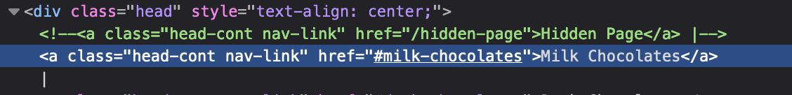

# Feb 01 - Chocolate

## Description

The first thing I want to give everyone is chocolate, of course. I found this wonderful company that sells the most exquisite chocolates, but I heard that they sell a super special secret valentine chocolate that's hidden somewhere on their website. Here's the website, do you think you can find it for me?

Author: Manav (0xmmalik)

## Other Information

Value: 3 coins

Link: [https://chocolates-mhsctf.0xmmalik.repl.co](https://chocolates-mhsctf.0xmmalik.repl.co){:target="_blank"}

## Solution

The first things I did was take a look in the HTML of the website for the start of the flag format `valentine{`. That resulted in no results, so seeing the word `hidden` in the description, that is what I decided to look for next. It did come back with a result, that there is a commented out selection button.



Going straight to this page however, I was met with a big text seen below.


Without a key, I decided to do some more digging around on the other network traffic the site generates, and I ended up finding a key in the CSS that website sent me.


That got me to the hidden page, but now was requesting that I verify I was an admin. With a new link that it would have me visit [https://chocolates-mhsctf.0xmmalik.repl.co/admin-check?key=anotherkeylol](https://chocolates-mhsctf.0xmmalik.repl.co/admin-check?key=anotherkeylol). Going to this page, I was greeted with an Amogus imposter page, so clearly I was not the admin. However in the last 2 pages I realized that I was given a cookie, this cookie was split up into a few sections, the first was verty obvious just some base64 encoded json `{"admin":"false"}`, while the other 2 pieces didn't really make sense at first glance. I got stuck on this quite some time, until I was looking through the discord, and an admin mentioned that you may need to brute force something **locally** for the challenge and linked rockyou. This got be digging into how this cookie was being generated. Using the tool Wapalyzer, it showed me that this was flask app, so now to figure out how session cookies are generated in flask. After some googling, I found this helpful [link](https://blog.paradoxis.nl/defeating-flasks-session-management-65706ba9d3ce){:target="_blank"} that explained how a flask session is `SHA1(SessionData + Timestamp + secret_key)` with the data, timestamp, and hash being sent to the user. This seems to track since we had 2 unknown fields for our cookie. This article linked a tool called `flash-unsign` that would take can take a wordlist, and website bearing a cookie and bruteforce the secret key. Using this tool I was able to get the secret key of `BATMAN`

```bash
flask-unsign --unsign --server https://chocolates-mhsctf.0xmmalik.repl.co/hidden-page\?key\=thedarkestchocolate --wordlist rockyou.txt --no-literal-eval
```

This tool also lets you sign new cookies if you have the secret key, so I created new data I wanted to be in the cookie `{"admin":"true"}` and signed it with the secret key. This resulted in a new cookie that I could use to get the flag.

```bash
$ echo "{\"admin\":\"true\"}" | flask-unsign --sign --secret BATMAN -c
eyJhZG1pbiI6InRydWUifQ.Y-L8XQ.eOFsDZvHOA_yBQ0Q6QWl1vtBXQU
$
```

Changing my cookie to this new one, and going back to the admin verification page, I was greeted with the flag.


