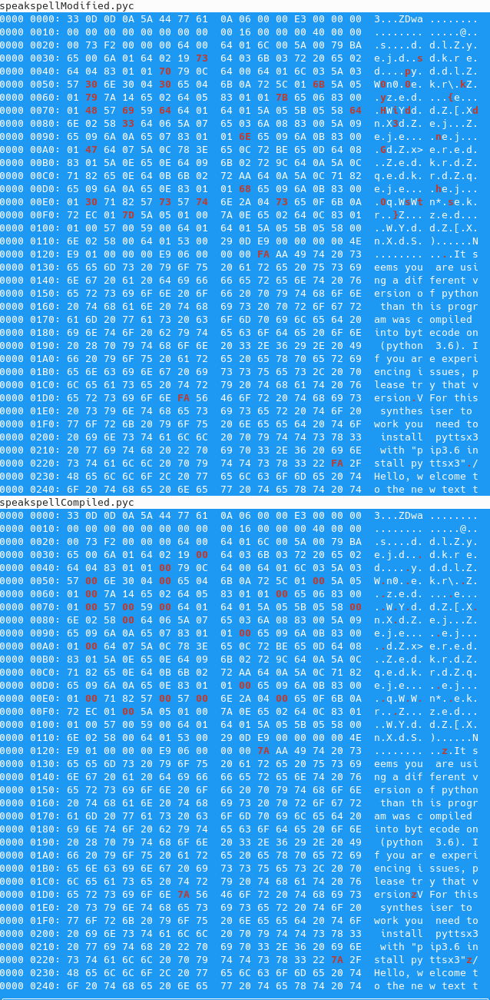

# TCP Phantom

This was a challenge that I created for the Sp00kyCTF, and based it off of a similar challenge to in the ALLES!2021 ctf event. I decided to create this challenge because I thought was really interesting when I solved it the first time, and would be a good beginner challenge since it was going to be students with less experience.

When I did the ALLES challenge, I learned that in python 3.6 and greater compiled operation codes went from occupying 1 or 3 bytes depending on if the operation took an argument or not. Which was switched to always occupying 2 bytes, and leaving the second byte empty if no argument was needed. Which leaves a dead zone byte that does not change how the execution happens no matter what is there.

After some time googling during the ALLES ctf, I ended up finding a tool that could extract things that were hidden in pyc files. This led me to use [Stegosaurus](https://bitbucket.org/jherron/stegosaurus/src/master/) to extract the payload in the compiled file, leaving me with something that if I remember correctly needed one more step like going through a ROT13 cipher to find the flag. To me this made it almost required that you knew how to find those deadzones, or use a tool find them for you. While that was fun in that CTF, I decided to remove that last step of obfuscation to make it a little easier, to find the flag.

The description of the challenge gave this with a pair of pyc files attached speakspellCompiled abd speakspellModified.

```txt
While working on our haunted house, we were designing a voice synthesizer to add some 
raspy voices to the hallways, and for testing we shared the compiled python to save that little bit of bandwidth. 
However, one of our employees received what seems to be a modified version with a different hash and ran it. 
As far as we can tell there was no functionality changed, 
but we want your help in figuring out what was added to see how bad we were hacked.
```

The first step I would have done facing this was decompile both versions and see if there was something different like a function call, doing this reveals identical decompiled python code. 

```py
# uncompyle6 version 3.8.0
# Python bytecode 3.6 (3379)
# Decompiled from: Python 3.9.5 (default, May 11 2021, 08:20:37) 
# [GCC 10.3.0]
# Embedded file name: challenge.py
# Compiled at: 2021-10-25 18:57:14
# Size of source mod 2**32: 1546 bytes
import sys
try:
    if sys.version_info[1] != 6:
        print('It seems you are using a different version of python than this program was compiled into bytecode on (python 3.6). If you are experiencing issues, please try that version')
    try:
        import pyttsx3
    except ImportError as error:
        print('For this synthesiser to work you need to install pyttsx3 with "pip3.6 install pyttsx3"')
        exit()

    introString = 'Hello, welcome to the new text to speech engine'
    engine = pyttsx3.init()
    engine.say(introString)
    engine.runAndWait()
    continueCollecting = True
    while continueCollecting:
        stringToSpeak = input('What would you like said aloud? Type q or empty line to exit\n')
        if stringToSpeak == 'q':
            continueCollecting = False
        elif stringToSpeak == '\n':
            continueCollecting = False
        else:
            engine.say(stringToSpeak)
            engine.runAndWait()

except OSError as error:
    print('If you are seeing this the required os components are not installed for pyttsx3 if you are on linux try run "sudo apt update && sudo apt install espeak ffmpeg libespeak1"')
# okay decompiling speakspellCompiled.pyc
```

The next idea that comes across my mind would be. To take a look for tools that relate to hiding information within python bytecode, like Stegosaurus which would correctly pull the flag out from the modified file. However, this was not the only way to get the string out of the modified file. Since the only changes were the addition of the characters in the dead zones, you could compare the hexdumnps of the two files to find the difference.


Here is a image showing the differences between the two files from xxd after highlighting the differences. The first few characters stand out and show the flag is in plain text, which means you could continue through the file and keep finding the differences.Getting ```sp00ky{Hidd3nGh0sts}```

After seeing it in plain text though, I would not to go through it by hand trying to pick out the individual characters, instead I would use something to highlight the differences to make it much easier to see like I did with the image below using vbindiff.



Which gets the flag fairly easily after putting the letters together. Since I did not want this to be a wild goose chase either about trying to find information, I tried to lay some clues inside the file like checking for the python version while running it, and making a comment it was compiled in python 3.6, to lead them towards what changed in compiled python in 3.6. This would also be important if they wanted to use Stegosaurus to extract the flag, as it requires python 3.6 to properly extract the flag.