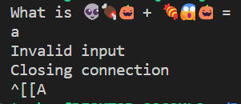
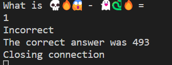

# ➕➖🟰

## Description

Numbers are hard, can you help me?

If you are running windows powershell, try this to get UTF-8 encoding

```powershell
$OutputEncoding = [console]::InputEncoding = [console]::OutputEncoding = New-Object System.Text.UTF8Encoding
```

This was pulled from for those that want to look before running. [https://stackoverflow.com/questions/49476326/displaying-unicode-in-powershell](https://stackoverflow.com/questions/49476326/displaying-unicode-in-powershell)

## Other information

Value: 25 points

Connection to remote server was included, but is no longer up.

## Solution

If you connect to the server with any variety of methods, you get something like this back:

```txt
What is 👽🍖🎃 + 🍬😱🎃 = 
```

First thing I did was give a random value, and got back a thing saying it was an invalid input:



If you give it a number it gives a different response that the answer in incorrect, adn includes what the right abswer is:



Running it a few more times, there is just addition and subtraction problems given. So what you would need to do is repeatedly get problems wrong to build up a list of problems and answers that would form a system of equations. Doing this, you could figure out that emojis are a single substitution cipher for each character. So you could do the substitutions by hand, to solve the problem, however it required 10 solutions in 60 seconds to get the flag, so you had to move quickly

| Emoji | Value |
|-------|-------|
| `🔥` | `0` |
| `🐍` | `1` |
| `👻` | `2` |
| `😱` | `3` |
| `🎃` | `4` |
| `😈` | `5` |
| `👽` | `6` |
| `💀` | `7` |
| `🍖` | `8` |
| `🍬` | `9` |

If you got the 10 problems right, you got the flag:
`sp00ky{w3lc0m3_t0_3m0j1_m4th}`

This challenge led into [✖️➗➕➖🟰](../MultpDiv/) which is a very similar challenge, but __required__ scripting to solve.

## Extra

I personally scripted this, and the next emoji challenge at same time, and it can be found here [solution.py](solution.py). If you want to try this yourself a server have been included [AddSubServer.py](AddSubServer.py).
