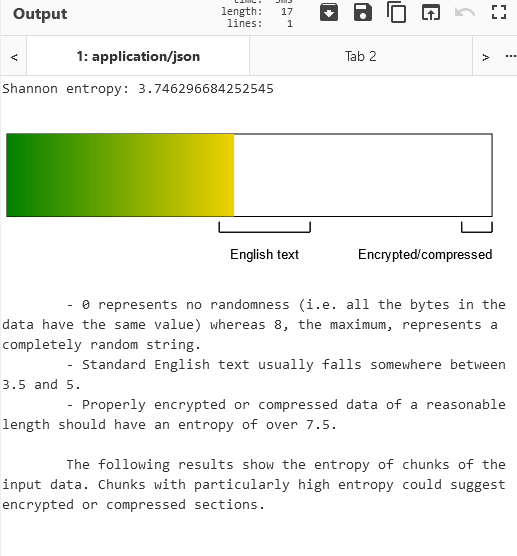

# 🐝🎥

## Description

Look at all those emoji, can you find the flag.

Both files are the same text just with different emojis, since Unicode is dumb and doesn't play nice on all operating systems.

## Other information

Value: 75 points

Included files: [out.emoji](out.emoji), [out2.emoji](out2.emoji)

## Solution

This challenge was a single substitution cipher of all the characters in the Bee Movie script with the flag inserted in the middle.

For my solution I will be using a the file `out2.emoji` as the cipher text. The same ideas apply to `out.emoji` as well just with different emojis.

The way that I would approach this challenge is to first view the entropy of the file, in an attempt to find if the information we were given ahs a high likelihood of being plaintext with some form of substitution applied. Running these through CyberChef's entropy tool, we can see that the entropy is very much within the range of english plaintext.



With this knowledge, there are a variety of attacks that can occur against this. With a good option being a character frequency analysis attack. With the text being so large, there is a large amount of data available to use to determine the most likely characters, and their potential substitutions. While this unlikely to get all of the characters, after getting the first small bit of the first part of the text `According to all known laws of aviation`, we can determine that the text is the script from the Bee Movie, making it much easier to determine *most* of the missing characters. Another potential way tof igure this out is look at the title of the challenge, and realize the emojis are Bee and Movie.

Specifically [this version](https://gist.githubusercontent.com/MattIPv4/045239bc27b16b2bcf7a3a9a4648c08a/raw/2411e31293a35f3e565f61e7490a806d4720ea7e/bee%2520movie%2520script) of the script was used, but any copy would work to find the characters. This would leave us with the table below where 3 emojis do not have a substitution. That can be seen in the table below with NA being used to represent the unknown characters.

| Character | Substitution | Character | Substitution | Character | Substitution |
|-----------|--------------|-----------|--------------|-----------|--------------|
| ` ` (Space) | `🌌` | `y` | `👨` | `W` | `🐕` |
| `a` | `🏭` | `z` | `👩` | `X` | `☕` |
| `b` | `🔥` | `A` | `🇦` | `Y` | `🔑` |
| `c` | `👻` | `B` | `😱` | `'` | `🍖` |
| `d` | `👽` | `C` | `🦃` | `,` | `👋` |
| `e` | `🍉` | `D` | `📀` | `.` | `🛑` |
| `f` | `🍎` | `E` | `🧸` | `\n` | `🔞` |
| `g` | `✨` | `F` | `🍩` | `!` | `👀` |
| `h` | `🎂` | `G` | `🍪` | `?` | `💸` |
| `i` | `🏊` | `H` | `🍁` | `-` | `🌕` |
| `j` | `👍` | `I` | `🇲` | `:` | `🌑` |
| `k` | `👎` | `J` | `🥘` | `"` | `🌚` |
| `l` | `🌈` | `K` | `🛸` | `NA` | `🌝` |
| `m` | `🍕` | `L` | `🇮` | `NA` | `🌞` |
| `n` | `👌` | `M` | `🇳` | `NA` | `🌛` |
| `o` | `👾` | `N` | `💾` | `0` | `🥜` |
| `p` | `🤖` | `O` | `🇸` | `1` | `📹` |
| `q` | `👺` | `P` | `🥞` | `2` | `📺` |
| `r` | `👹` | `Q` | `🥢` | `3` | `🍴` |
| `s` | `👿` | `R` | `🥟` | `4` | `🧊` |
| `t` | `🤡` | `S` | `🎁` | `5` | `🍆` |
| `u` | `🇪` | `T` | `🏁` | `6` | `🌮` |
| `v` | `👶` | `U` | `💳` | `7` | `🍑` |
| `w` | `👦` | `V` | `🎄` | `8` | `💻` |
| `x` | `👧` | | | `9` | `📱` |

Making a decoder with this table, we can decode most of the text, to see if there are context clues as to what they are. I created this first pass [here](decoderFirstPass.py) that does all subistution while ignoring the 3 characters that do not have a substitution. This gives us the whole script of the Bee Movie, with a partially decoded flag right in the middle.

```txt
Not yet it isn't. But is this what it's come to for you? Exploiting tiny, helpless bees so you don't have to rehearse your part and learn your lines, sir?
sp00ky🌝th4ts🌛4l0t🌛0f🌛subs🌞
Watch it, Benson! I could blow right now!
```

Knowing the flag format is `sp00ky{flag}`, there smiling moon and sun can be swapped for the curly braces. Leaving a single emoji needing figured out. You could randomly guess, but the flag has leet speak for `thats alot of subs`, so a good guess with context is `_` which is common in leet speak spaces. Replacing these gives the final flag of `sp00ky{th4ts_4l0t_0f_subs}`.

The final decoder, that will read in `out2.emoji` and output the whole script with the flag is [here](decoder.py).

## Extra

If you are looking to do a similar challenge, both encoders have been included with the encoder pulling down the script upon running. [Encoder](encoder.py) and [Encoder2](encoder2.py).
