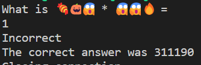
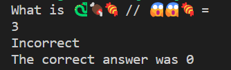

# ✖️➗➕➖🟰

## Description

This is even harder numbers. You got this!

If you are running windows powershell, try this to get UTF-8 encoding to show the emojis

```powershell
$OutputEncoding = [console]::InputEncoding = [console]::OutputEncoding = New-Object System.Text.UTF8Encoding
```

This was pulled from for those that want to look before running. [https://stackoverflow.com/questions/49476326/displaying-unicode-in-powershell](https://stackoverflow.com/questions/49476326/displaying-unicode-in-powershell)

## Other information

Value: 50 points

Connection to remote server was included, but is no longer up.

## Solution

This challenge is very similar to the previous emoji math one [➕➖🟰](/competitions/sp00kyCTF2022/EMOJI/AddSub/). The only difference is that this one has multiplication, integer division, and modulus. It also required solving many more problems in the same 60 seconds, 1000 to be exact. This would require the use of a script to solve. To make it easier, and not require re-enumeration of the numbers, they remained the same. The examples of multiplication and division are shown below.




| Emoji | Value |
|-------|-------|
| `🔥` | `0` |
| `🐍` | `1` |
| `👻` | `2` |
| `😱` | `3` |
| `🎃` | `4` |
| `😈` | `5` |
| `👽` | `6` |
| `💀` | `7` |
| `🍖` | `8` |
| `🍬` | `9` |

For this I created a [python script](solution.py) to work through these, and the previous challenges problems. It solves the problems, by connecting the server and getting the problem, parsing the problem in a series of strings, converting the emojis to numbers, and then solving the problem. It then sends the answer back to the server, and repeats until it has solved 1000 problems.

After solving 1000 problems, you got the flag:
`sp00ky{4dv4nc3d_3m0j1_m4th}`

## Extra

Something I did not account for when making this challenge, was the random number generate picking 0, then trying to divide by zero. So there is a potential that you could get a division by zero, and the server would throw an error, and crash. This would cause the script to fail, and you would not get the flag. This was realized with about 15 minutes left in the competition when people were hitting it hard, so the fix restart it.

A server has been included if you want to try yourself [here](server.py). Note: it has the same issue listed above, and may crash if you are unlucky.
