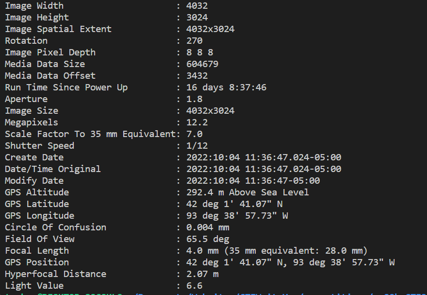
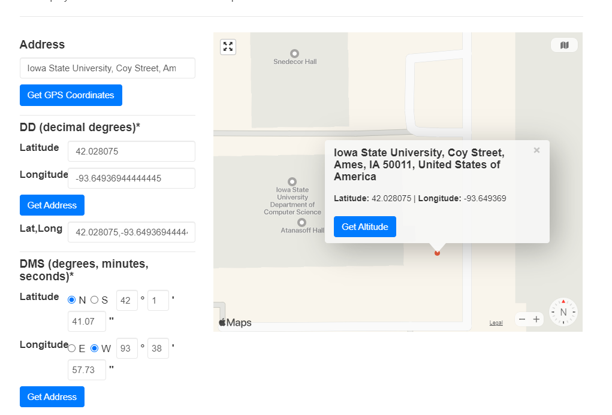

# CampusLife1

## Description

Welcome to campus, I was exploring and found this creepy area on campus, but don't seem to remember where I was. I was wondering if you could help me find what building this is in?


Both images should give the same output. Just different file types for convenience. The flag will be sp00ky{building}

## Other information

Value: 25 points

Included files: [SpookyScary.png](SpookyScary.png), [SpookyScary.HEIC](SpookyScary.HEIC)

## Solution

For this challenge you are given a pair of images, and told to find the location. This image does not give a lot go on just a dingy wall. In many images there is often metadata about the image, called the exif data, that can contain lots of useful information. So, I decided to use a tool called [exiftool](https://exiftool.org/) to see if there was any metadata in the image. I ran the command `exiftool SpookyScary.HEIC` and got the following output:



As you can see there is a GPS location included as part of the exif data of the image. You can then plug this into some online tool to get the location of where the images was taken. I used [this site](https://gps-coordinates.net), and got this as the result.



This could be a few possible buildings, since there are a couple right around there. I decided to go with atansoff since it has always had that same creepy vibe I get from the image. Making the flag `sp00ky{atansoff}`.

Understandably, there are a variety of possible flags since GPS isn't exact. So here are all the possible flags:

```txt
sp00ky{atanasoff hall}
sp00ky{atanasoff}
sp00ky{snedecor}
sp00ky{snedecor hall}
```
