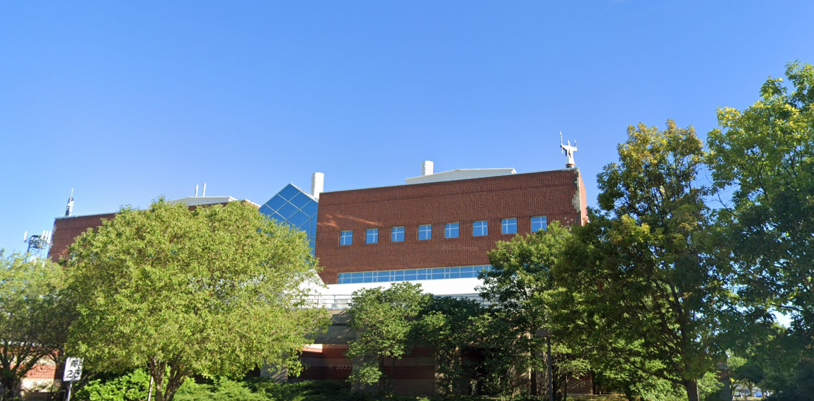

# CampusLife2

## Description

I was continuing to wander buildings on campus, and saw this really nice parking lot out the windows, but got super turned around in the building before I could get out, and it seems to have dissapeared on me? Could you tell me what parking lot number has this green car in it?

The flag is sp00ky{123} where 123 is the lot number.

## Other information

Value: 50 points

Included files: [IMG_7212.jpg](IMG_7212.jpg), [IMG_7214.jpg](IMG_7214.jpg)

## Solution

For this challenge you are given a pair of images, and told to find the parking lot they are looking at. The first things I did was look at the exif data again, but they revealed nothing interesting. So solving this requires some knowledge of Iowa State's campus. Taking a look at the second image there is a smokestack on top of the building, overall on campus there are not very many buildings with this, with the most likely building being Gilman hall. so you could jump into street view to try figure out where those other buildings are. Going down Pammel Drive, you can find the silver building quickly.

That isn't exact however, as there a few parking lots between it and Gilman, again looking at the second image, there is a radio beacon on the roof of the building you are facing. Taking more of a look around the area around, there is this building with a radio beacon on the roof.

This gives us the direction that we are facing, and a good street corner, so if we could find a map with the lot numbers, we could track back to where the images were taken. And guess what, ISU has just that map [here](https://www.parking.iastate.edu/where). Looking at the corner we were on, we can see that parking lot is numbered 25 and is the one with the green car. So the flag is `sp00ky{25}`.

