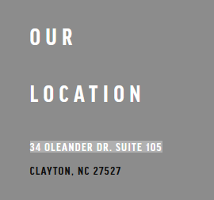

# SeekingSomeone

I got a mysterious message from someone saying this is where they were, can you help me find where this picture was taken? The flag is the street address where the photo was taken without spaces and expanding abreviations. For example `123 Univerity Ave.` would be `sp00ky{123UniversityAvenue} `


## Other information

Value: 25 points

Included files: [Location1.jpg](Location1.jpg)

## Solution

For this challenge there is a single image, and we are tasked with finding the address. Immediately, there is a door with a website on it [https://www.victorypoweryoga.com/](https://www.victorypoweryoga.com/). Going to that website there is a nice area called `Our Location` that nicely points us to the address of `34 Oleander Dr. Suite 105` expanding the abbreviations we get `sp00ky{34OleanderDriveSuite105}`.



Being an OSINT challenge, there were a few possible flags that were all valid:

```txt
sp00ky{34OleanderDriveSuite105}
sp00ky{34OleanderDrive}
sp00ky{34OleanderDr}
```
