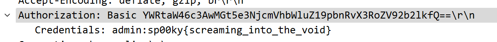

# Pulling Passwords from Thin Air

## Description

I seem to have lost my password, and can't seem to find where I wrote it down. But I've got a device using it for another purpose on my network, so maybe it is somewhere in this packet capture I took at my house?

## Other information

Value: 50 points

Included files: [air-raid.cap](air-raid.cap)

## Solution

Opening up this network capture in a tool like Wireshark there is a lot of information, combinations of MDNS, 802.11, TCP, SSH, and HTTP. My immediate goto would be the HTTP traffic, as it is unencrypted, and something that I can view easily. And there a few HTTP packets, with one of them getting a 200 response from the server.

Taking a look at the request this is a `GET` request to `/` with quite a few headers. One of which being `Authorization`, and has the value of `Basic YWRtaW46c3AwMGt5e3NjcmVhbWluZ19pbnRvX3RoZV92b2lkfQ==`. Taking a look at what Basic HTTP authorization is, this is a base64 encoded string of `<username>:<password>`. So decoding this gives us the username `admin` and the password `sp00ky{screaming_into_the_void}` which is your flag.

## Extra

I also really like how Wireshark will automatically decode this authorization header for you, instead of having to use a different tool.

