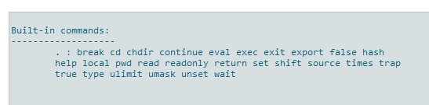
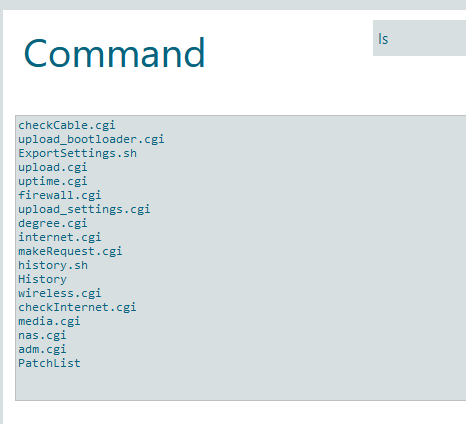
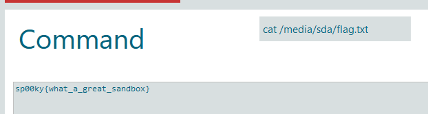

# Router, I barely know her!

## Description

Well there is a wifi network, and there is a password for an http thing. I wonder what you can do with that? There is a file somewhere on something that has the flag.

PS: There is no need to write any files for this challenge. Please do not break anything...

## Other information

Value: 75 points

This requires that [IT'S IN THE AIR?!?!](/competitions/sp00kyCTF2022/RealWorld/ITSInTheAir/) is solved.

## Solution

In the previous challenge there was a request being made to the router, and the password was being sent in the request. So we can just use that password to log into the router's web interface after connecting to the wifi. Either digging into the menu we get after that, or by looking at the request. There is an endpoint `http://10.10.10.254/advanced/system_command.shtml` that just gives you a shell. Officially running `help` gives you a list of commands that you can use, it is pretty limited.

This is a limited list, but if you try to run pretty much any common linux command like `ls` for example. You do not get an error, it lets you run the command and returns the value without issue.

If you went to look at the router, there is a flash drive sticking out the back. So this is most likely where the flag. Doing `ls /mnt` shows there are no mounts there, but doing `ls /media` which is another mounting directory on the root of the filesystem reveals 1 drive. Going into that drive there is a single text file called flag.txt. Now the list of commands you can use, but aren't on the list isn't limited to just `ls`, so all you need to do is `cat /media/sda/flag.txt` since you know the path to the flag.

This gives the flag of `sp00ky{what_a_great_sandbox}`
